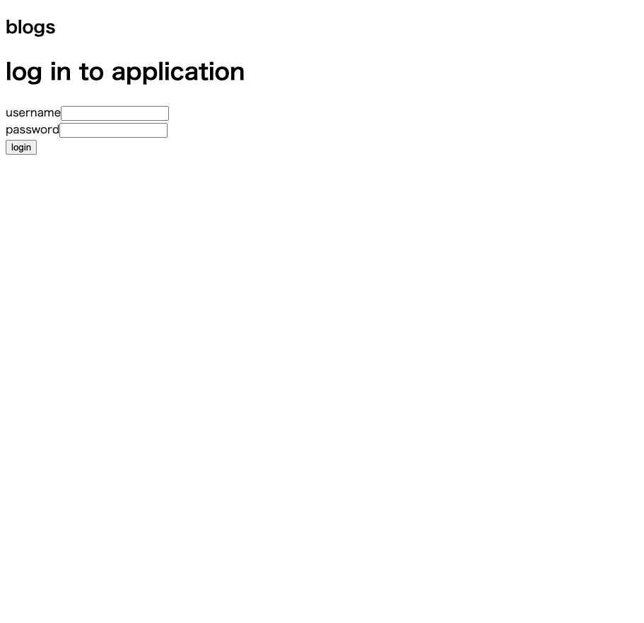
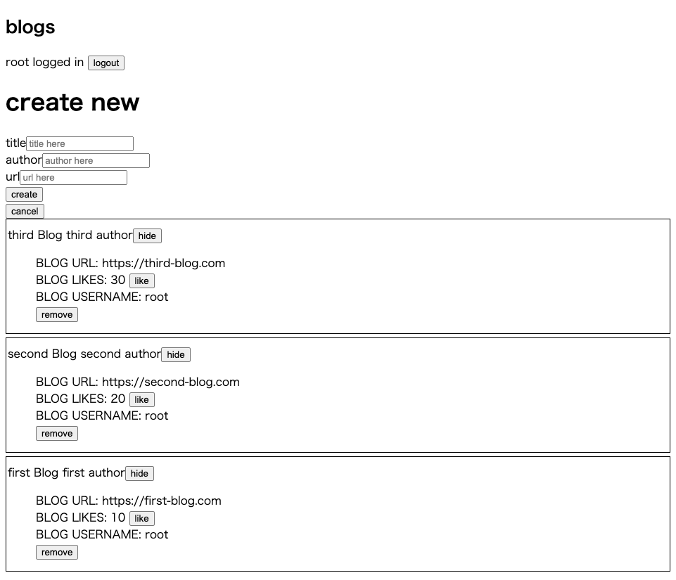

# About this repository

This is the repository for Full Stack open 2022. 
(URL:https://fullstackopen.com/en/)

I want to learn more recently FullStack technology, and I deceided to take the course.

This repository is for server side of Part4 and Part5.

Part4 is Testing Express servers, user administration : (URL:https://fullstackopen.com/en/part4)  
Part5 is Testing React apps : (URL:https://fullstackopen.com/en/part5)  

Through the above courses, student had to created simple bloglist application.
And, I finished the task.

The main purpose of this course is authorization/authentication and testing library.
In the part of Authorization/ Authentication, I could learn the current web trend for login / register form.
In the part of testing library, I could learn the fundamental of JEST, supertest, react-testing-library, user-event and cypress.

## Demo site
Sorry, but this course did not use Heroku.
So, I did not deploy the demo site.

## ScreenShots of the project
This course is not for CSS. So, the images are not fancy.  
But, the application can login with JSON WEB TOKEN, and have CRUD(CREATE, READ, UPDATE, DELETE) function.

## .env file

MONGODB_URI= "your mongodb uri here"  
TEST_MONGODB_URI= "your test mongodb uri here"  
PORT= "your localhost port number here"  
JWT_SECRET="your jsonwebtoken secret here" 

Through the courses, I got the more knowledge of the latest web developer's world.
Fundamentals is always most important thing in the programming world.
So, I am satisfied with this course.

Thank you for reading.
And, happy coding!!!
